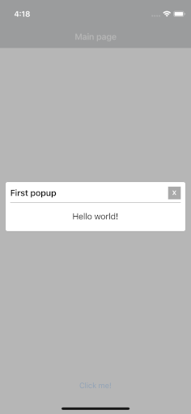
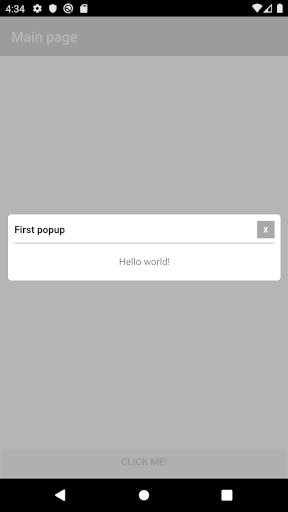

# Xamarin.Forms (iOS+Android) MvvmCross scaffolding with basic popup management

I started this project to learn:

* How to crete a popup dialog using MvvmCross patterns

Test modify readme Fix 006

Qui voglio fare altro

## Screenshots 




## Credits 

[Xamarin](https://dotnet.microsoft.com/apps/xamarin)

[MvvmCross](https://www.mvvmcross.com/)

[Stackoverflow](https://stackoverflow.com/)

## Project Setup

```sh
dotnet new --install MvxScaffolding.Templates
dotnet new mvxforms --name MvxPopup --solution-name MvxPopup
git init 
dotnet new gitignore
git add --all
git commit -m "initial commit"
```

As you can see in the source code ...

In the `.Core` project

* Add file `/Services/IPopuopService.cs`
* Add file `/ViewModels/BasePopupViewModel.cs`
* Add file `/Viewmodels/.../YourCustomPopupViewModel.cs`

In the `.Droid` project

* Add file `/Services/PopupService.cs`
* In file `/Views/MainActivity.cs` add line `Xamarin.Essentials.Platform.Init(this, bundle);`
* In file `Setup.cs` add line `[...].RegisterType<IPopupService, PopupService>()`

In `.iOS` project 

* Add file `/Services/PopupService.cs`
* In file `Setup.cs` add line `[...].RegisterType<IPopupService, PopupService>()`

In `.UI` project 

* Add file `/Services/PopupPage.xaml` &amp; `/Services/PopupPage.xaml.cs`
* Add file `/Pages/.../YourCustomPopupView.xaml` &amp; `/Pages/.../YourCustomPopupView.xaml.cs`

## How to use it 

1. In the Core project: Create a CustomizedPopupViewModel that inherits from BasePopupViewModel

```csharp
public class HelloWorldPopupViewModel : BasePopupViewModel
{
    private string _message;
    public string Message { get => _message; set => SetProperty(ref _message, value); }
}
```

2. In the UI project: Create a CustomizedPopupView that inherits form MvxContentView<CustomizedPopupViewModel>

```xml
<views:MvxContentView
    xmlns="http://xamarin.com/schemas/2014/forms"
    xmlns:x="http://schemas.microsoft.com/winfx/2009/xaml"
    x:TypeArguments="viewModels:HelloWorldPopupViewModel"
    xmlns:views="clr-namespace:MvvmCross.Forms.Views;assembly=MvvmCross.Forms"
    xmlns:viewModels="clr-namespace:MvxPopup.Core.ViewModels.Home;assembly=MvxPopup.Core"
    x:Class="MvxPopup.UI.Pages.HelloWorldPopupView">
    <ContentView.Content>
        <Label
            Margin="0"
            Padding="0"
            HorizontalOptions="CenterAndExpand"
            VerticalOptions="CenterAndExpand"
            Text="{Binding Message}" />
    </ContentView.Content>
</views:MvxContentView>
```

3. In your PageViewModel: Inject IPopupService in the constructor and call the method `Open` when required 

```csharp
public class HomeViewModel : BaseViewModel
{
    private readonly IPopupService _popupService;

    public HomeViewModel(IPopupService popupService)
    {
        OpenPopupCommand = new MvxCommand(OnOpenPopupCommand);
        _popupService = popupService;
    }

    #region commands

    public IMvxCommand OpenPopupCommand { get; }
    private void OnOpenPopupCommand()
    {
        var popupViewModel = new HelloWorldPopupViewModel
        {
            Title = "First popup",
            Message = "Hello world!"
        };
        _popupService.Open(popupViewModel);
    }

    #endregion commands
}
```